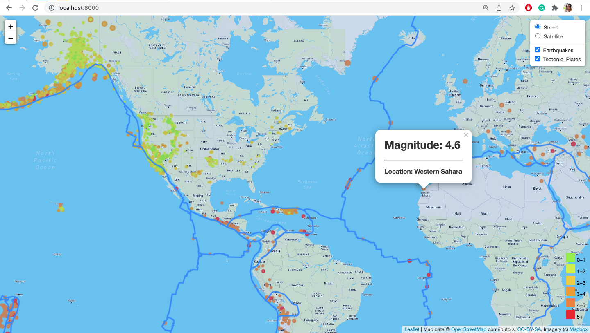
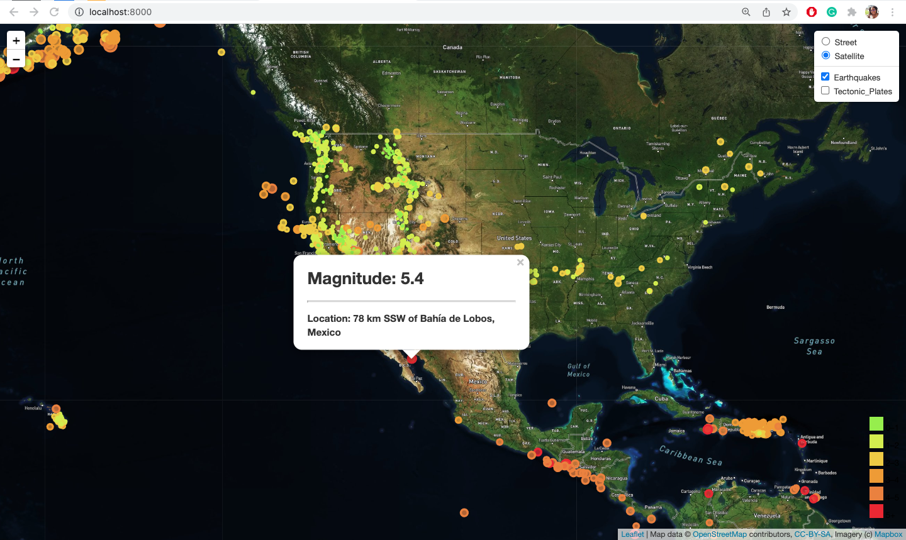
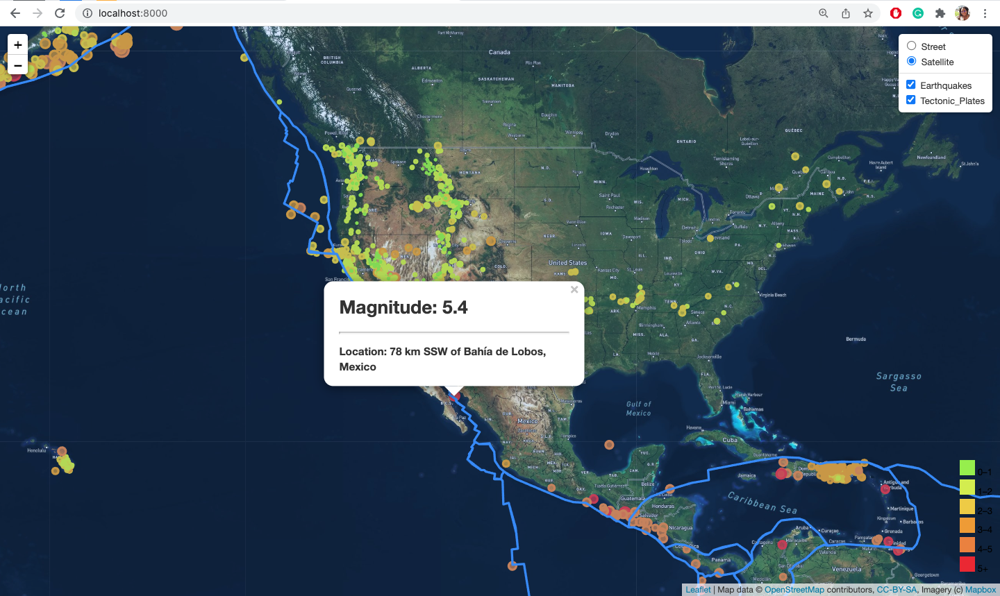
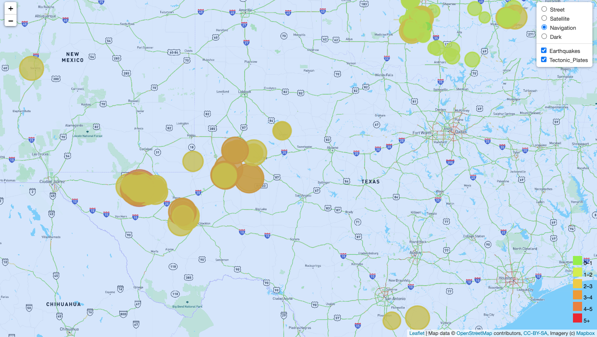
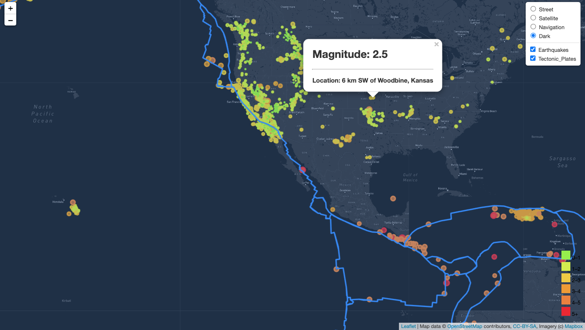

# leaflet-challenge
<a href="https://bakeralexan.github.io/leaflet-challenge/">This is an example of interactive map visualization using leaflet and JavaScript.</a>

<a href="https://bakeralexan.github.io/leaflet-challenge/">https://bakeralexan.github.io/leaflet-challenge/</a>


## Background


Welcome to the United States Geological Survey, or USGS for short. The USGS is responsible for providing scientific data about natural hazards, the health of our ecosystems and environment; and the impacts of climate and land-use change. Their scientists develop new methods and tools to supply timely, relevant, and useful information about the Earth and its processes. As a new hire, you will be helping them out with an exciting new project!

The USGS is interested in building a new set of tools that will allow them to visualize their earthquake data. They collect a massive amount of data from all over the world each day, but they lack a meaningful way of displaying it. Their hope is that being able to visualize their data will allow them to better educate the public and other government organizations (and hopefully secure more funding) on issues facing our planet.


### Visualization


Visualize an earthquake data set.

1. **Data Set**

   

   The USGS provides earthquake data in a number of different formats, updated every 5 minutes. Visit the [USGS GeoJSON Feed](http://earthquake.usgs.gov/earthquakes/feed/v1.0/geojson.php) page and pick a data set to visualize. When you click on a data set, for example "All Earthquakes from the Past 7 Days", you will be given a JSON representation of that data. You will use the URL of this JSON to pull in the data for our visualization.

   

2. **Import & Visualize the Data**

```const earthquakeURL = "https://earthquake.usgs.gov/earthquakes/feed/v1.0/summary/all_month.geojson";```

   Create a map using Leaflet that plots all of the earthquakes from your data set based on their longitude and latitude.

    ```const street= L.tileLayer('https://api.mapbox.com/styles/v1/mapbox/streets-v11/tiles/{z}/{x}/{y}?access_token={accessToken}', {
        attribution: 'Map data &copy; <a href="https://www.openstreetmap.org/">OpenStreetMap</a> contributors, <a href="https://creativecommons.org/licenses/by-sa/2.0/">CC-BY-SA</a>, Imagery (c) <a href="https://www.mapbox.com/">Mapbox</a>',
        maxZoom: 18,
        accessToken: API_KEY
    });
    const satellite = L.tileLayer('https://api.mapbox.com/styles/v1/mapbox/satellite-streets-v11/tiles/{z}/{x}/{y}?access_token={accessToken}', {
        attribution: 'Map data &copy; <a href="https://www.openstreetmap.org/">OpenStreetMap</a> contributors, <a href="https://creativecommons.org/licenses/by-sa/2.0/">CC-BY-SA</a>, Imagery (c) <a href="https://www.mapbox.com/">Mapbox</a>',
        maxZoom: 18,
        accessToken: API_KEY
    });```

   * Data markers should reflect the magnitude of the earthquake by their size and and depth of the earthquake by color. Earthquakes with higher magnitudes should appear larger and earthquakes with greater depth should appear darker in color.

    ```let earthquakeMarkers = L.layerGroup([]);
    // Create a map object, and set the default layers.
    const myMap = L.map("map", {
        center: [35.0902, -105.7129],
        zoom: 4,
        layers: [street, earthquakeMarkers]
    });
    d3.json(earthquakeURL).then(function (response) {
        let features = response.features;

        for (let i = 0; i < features.length; i++) {
            let feature = features[i];
            let geometry = feature.geometry;
            let property = feature.properties;
            let magnitude = property.mag;

            function markerSize(magnitude) {
                if (magnitude != 0 || magnitude != "NaN") {
                    return magnitude * 10000;
                } else{
                    magnitude = 0;
                }
            };
            function colorChange(magnitude) {
                if (magnitude < 1) return "#98ee00";
                else if (magnitude < 2) return "#d4ee00";
                else if (magnitude < 3) return "#eecc00";
                else if (magnitude < 4) return "#ee9c00";
                else if (magnitude < 5) return "#ea822c";
                else return " #ea2c2c";
            };``` 
    * Include popups that provide additional information about the earthquake when a marker is clicked.
            ```let earthquakeMarker = L.circle([geometry.coordinates[1], geometry.coordinates[0]], {
                color: colorChange(magnitude),
                fillColor: colorChange(magnitude),
                fillOpacity: 0.75,
                radius: markerSize(magnitude)
            }).bindPopup(`<h1> Magnitude: ${magnitude}</h1><hr><h3>Location: ${property.place}</h3>`);
            earthquakeMarker.addTo(earthquakeMarkers);
        }
        earthquakeMarkers.addTo(myMap);
    })```

   

   * Create a legend that will provide context for your map data.

    ```let legend = L.control({position: "bottomright"});
    // Then add all the details for the legend
    legend.onAdd = function() {
    let div = L.DomUtil.create("div", "info legend");

    const magnitudes = [0, 1, 2, 3, 4, 5];
    const colors = [
    "#98ee00",
    "#d4ee00",
    "#eecc00",
    "#ee9c00",
    "#ea822c",
    "#ea2c2c"
    ];
    for (let i = 0; i < magnitudes.length; i++) {
        console.log(colors[i]);
        div.innerHTML +=
            "<i style='background: " + colors[i] + "'></i> " +
            magnitudes[i] + (magnitudes[i + 1] ? "&ndash;" + magnitudes[i + 1] + "<br>" : "+");
        }
        return div;
    };

    // Finally, we our legend to the map.
    legend.addTo(myMap);```








The USGS wants you to plot a second data set on your map to illustrate the relationship between tectonic plates and seismic activity. You will need to pull in a second data set and visualize it alongside your original set of data. Data on tectonic plates can be found at <https://github.com/fraxen/tectonicplates>.

* Plot a second data set on our map.

    ```const platesURL = "https://raw.githubusercontent.com/fraxen/tectonicplates/339b0c56563c118307b1f4542703047f5f698fae/GeoJSON/PB2002_plates.json";```

* Add a number of base maps to choose from as well as separate out our two different data sets into overlays that can be turned on and off independently.

    ```const navigation = L.tileLayer('https://api.mapbox.com/styles/v1/mapbox/navigation-day-v1/tiles/{z}/{x}/{y}?access_token={accessToken}', {
        attribution: 'Map data &copy; <a href="https://www.openstreetmap.org/">OpenStreetMap</a> contributors, <a href="https://creativecommons.org/licenses/by-sa/2.0/">CC-BY-SA</a>, Imagery (c) <a href="https://www.mapbox.com/">Mapbox</a>',
        maxZoom: 18,
        accessToken: API_KEY
    });
    const dark = L.tileLayer('https://api.mapbox.com/styles/v1/mapbox/dark-v10/tiles/{z}/{x}/{y}?access_token={accessToken}', {
        attribution: 'Map data &copy; <a href="https://www.openstreetmap.org/">OpenStreetMap</a> contributors, <a href="https://creativecommons.org/licenses/by-sa/2.0/">CC-BY-SA</a>, Imagery (c) <a href="https://www.mapbox.com/">Mapbox</a>',
        maxZoom: 18,
        accessToken: API_KEY
    });```


    ```let plateLines = L.layerGroup([]);
    d3.json(platesURL).then(function createPlates(response) {
        L.geoJson(response)
            .addTo(plateLines);
    });
    const baseMaps = {
        Street: street,
        Satellite: satellite,
        Navigation: navigation,
        Dark: dark
    };
    const overlayMaps = {
        Earthquakes: earthquakeMarkers,
        Tectonic_Plates: plateLines
    };```

    * Add layer controls to our map.

    ```L.control.layers(baseMaps, overlayMaps, {
        collapsed: false
    }).addTo(myMap);
    ```










